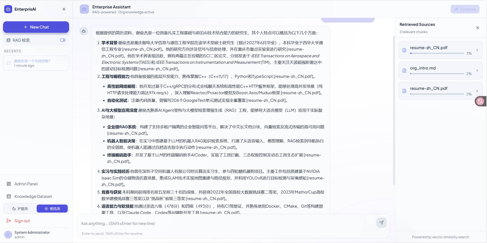
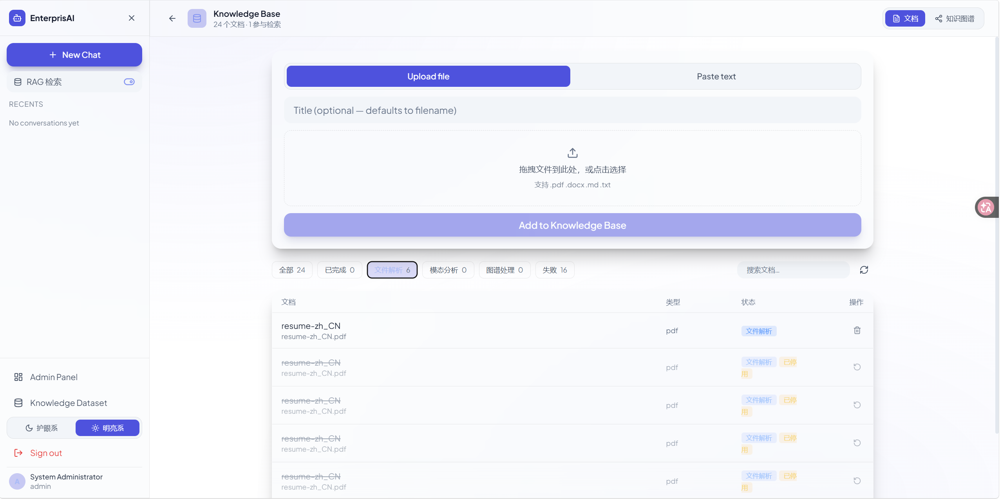
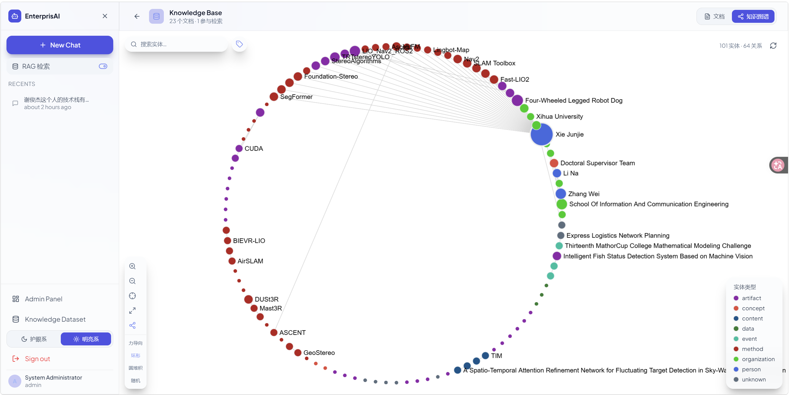
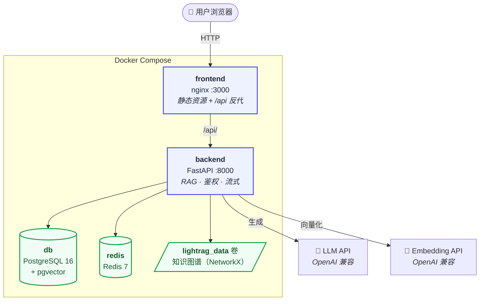
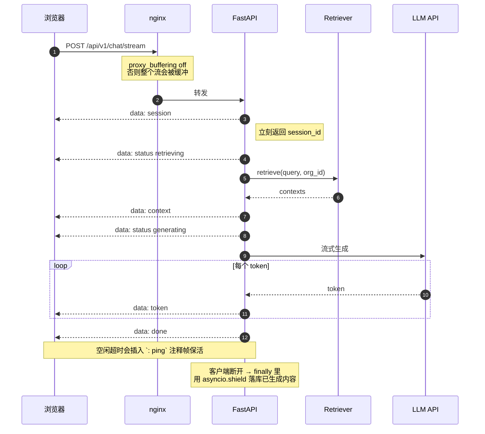
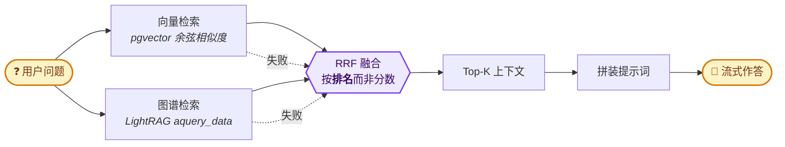
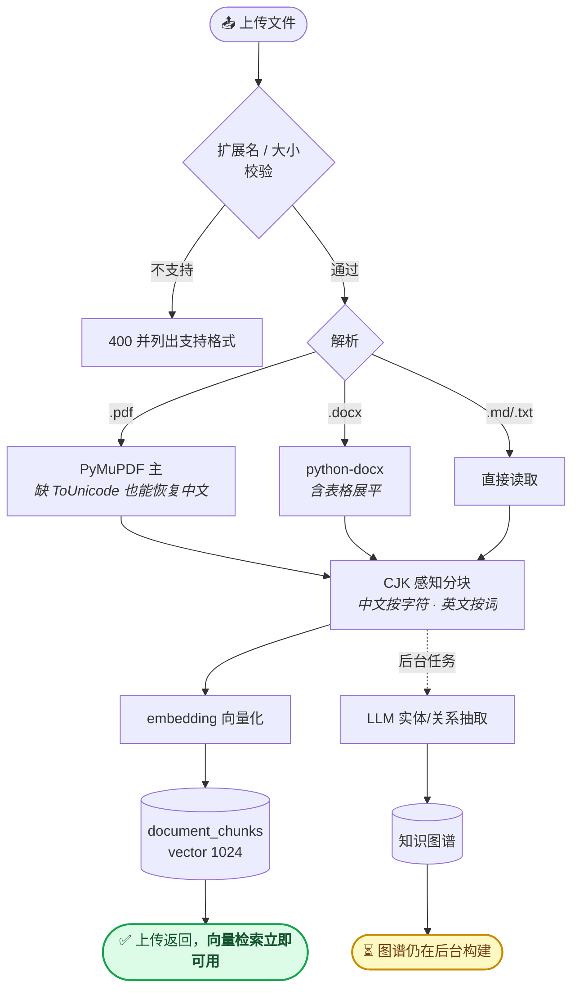
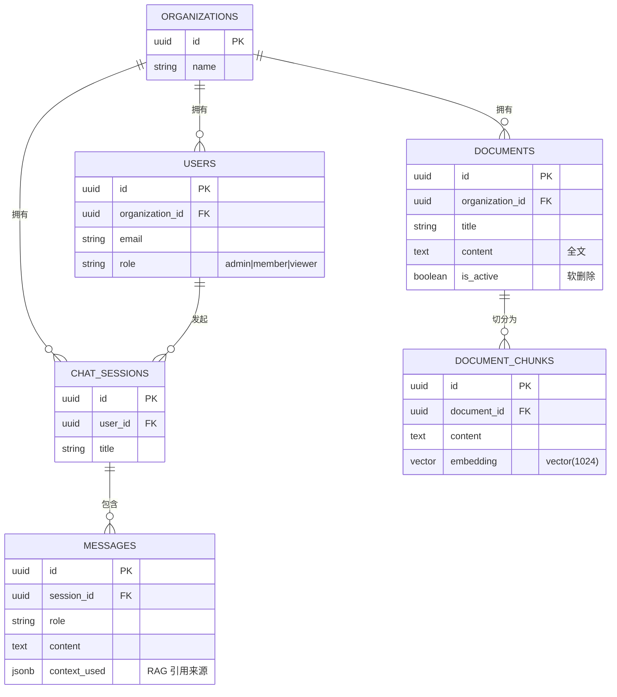

# 🤖 Enterprise Chatbot — 混合检索 RAG 平台

> 多租户 SaaS 智能问答平台。**向量检索**与**知识图谱检索**双路并行、按排名融合；支持 PDF / Word / Markdown / 纯文本入库；SSE 流式作答；前端双主题。

[](#-技术栈)
[](#2️⃣-混合检索)
[](#️-前端)
[](#-快速开始)

---

## ✨ 功能特性

| | 能力 | 说明 |
|---|---|---|
| 🔀 | **混合检索** | 向量 + 图谱双路并发，RRF 按排名融合，单路失败自动降级 |
| 🕸️ | **知识图谱** | LightRAG 抽取实体与关系，前端可视化（力导向 / 环形 / 圆堆积 / 随机） |
| ⚡ | **SSE 流式** | 分阶段事件 + 心跳保活；**断开连接已生成内容仍落库** |
| 📄 | **多格式入库** | PDF / DOCX / Markdown / TXT；PDF 双引擎（PyMuPDF 主 + pypdf 兜底） |
| 🇨🇳 | **中文优化** | CJK 感知分块（中文按字符、英文按词）+ 缺 ToUnicode 的中文 PDF 恢复 |
| 🎨 | **双主题** | 护眼系（暗）/ 明亮系（白底灰线黑字），CSS 变量驱动 |
| 🔌 | **供应商可插拔** | 仅需 `base_url` + `api_key`，LLM 与 Embedding 可指向不同供应商 |
| 🏢 | **多租户隔离** | 检索在 SQL 层前置过滤 `organization_id`，知识图谱按组织独立 workspace |
| 🔐 | **安全** | JWT 双 Token、bcrypt、按 IP 限流、审计日志、request-id 链路追踪 |

---

## 🖼️ 界面预览

### 💬 对话 —— 流式作答 + 引用来源

<div align="center">

</div>

逐 token 流式渲染，右侧面板列出本次回答引用了知识库里的哪些文档（`resume-zh_CN.pdf` 等），可回溯到原文。

### 📚 知识库 · 文档 —— 上传与状态管理

<div align="center">

</div>

拖拽上传 PDF / DOCX / Markdown / TXT；状态标签（**已完成 / 文件解析 / 模态分析 / 图谱处理 / 失败**）直接对应 LightRAG 的入库流水线阶段，一眼看出哪份文档还在处理、哪份被停用。

### 🕸️ 知识库 · 知识图谱 —— 实体与关系可视化

<div align="center">

</div>

上图是**环形布局**，另有力导向 / 圆堆积 / 随机三种。悬停高亮邻域、点击隔离聚焦，详见[前端](#️-前端)章节。

> 截图分别取自**护眼系**（对话、图谱）与**明亮系**（知识库文档）。两套主题可随时切换。

---

## 📐 架构总览



### 数据落盘位置

| 卷 | 内容 |
|---|---|
| `postgres_data` | 用户、组织、会话、消息、文档、`document_chunks`（向量） |
| `lightrag_data` | **知识图谱**，每个组织一个 workspace 子目录 |
| `backend_logs` / `backend_uploads` | 应用日志、上传文件 |
| `redis_data` | Redis AOF |

---

## 🔄 核心链路

### 1️⃣ 流式问答（SSE）



**三个不那么显然的实现点：**

1. **检索在流内执行** —— 检索要先做一次 embedding 网络往返；放在流外会让首帧延迟等于检索耗时。移进 generator 后，用户立刻能看到「检索中」。
2. **心跳用 producer 任务 + `asyncio.Queue`** —— 超时只取消 `queue.get()`，**绝不取消底层 LLM 流**（直接包 `wait_for` 会破坏 httpx 流）。
3. **断连落库要 `asyncio.shield`** —— 任务被取消时 `finally` 里的 `await` 会被**立即再次取消**，写库代码根本不会执行。这是"停止生成不丢数据"的关键。

### 2️⃣ 混合检索

**默认 `RAG_BACKEND=hybrid`** —— 向量与图谱双路并发、按排名融合。



**为什么用 RRF 而不是加权平均？**

两条链路的**分数不可比** —— 向量链路返回余弦相似度（绝对量纲），图谱链路的 `aquery_data` **根本不返回相似度**（我们只能给排名代理值）。加权平均没有意义，按 embedding 模型调权重还会随模型更换而失效。

```
score(doc) = Σ_路径  1 / (RRF_K + 该路径中的排名)        RRF_K = 60
```

RRF 不需要分数归一化：两条路径都排前的文档胜出，只有一条路径找到的仍能浮现（位置靠后）。分数范围 `[1/61, 2/61] ≈ [0.0164, 0.0328]`，**只有相对意义**。

> **实测**：4 个测试问题全部 `RRF = 0.0328 = 2/61` —— 意味着**两条链路各自独立都把正确文档排在第 1**。

三种模式由 `RAG_BACKEND` 切换：

| 值 | 行为 |
|---|---|
| `hybrid`（默认） | 双路并发 + RRF 融合 |
| `legacy` | 仅 pgvector 向量检索 |
| `lightrag` | 仅知识图谱检索 |

> ⚠️ **切换不迁移数据**。某个模式能不能答，取决于文档有没有被索引进对应存储。用 `scripts/reindex_lightrag.py` 把 Postgres 里已有的文档回灌进图谱。

### 3️⃣ 文档入库



**入库是「快同步 + 慢后台」两段式**：向量化只要一次 embedding 调用，同步做完；图谱抽取要多次 LLM 调用（数秒到数分钟），走后台任务。所以**上传返回时向量检索已可用，图谱还在追赶**。

图谱页顶部会显示 `⟳ N 个图谱任务处理中` 的横幅，明确告诉你视图还没收敛 —— 而不是让你对着旧数据猜。

---

## 🗃️ 数据模型



**多租户隔离**：`organization_id` 贯穿所有业务表；检索 SQL **前置过滤** `organization_id` 与 `is_active`，杜绝跨租户召回。对应到图谱，`organization_id` 直接作为 LightRAG 的 `workspace`。

> ⚠️ `EMBEDDING_DIMENSION` 必须与**三处**一致：`.env`、`models/chat.py` 的 `Vector(...)`、`database/init.sql` 的 `vector(N)`。不一致会**静默写入失败**（运行时报错，启动时不报）。

---

## 🗂️ 项目结构

```
enterprise-chatbot/
├── backend/
│   ├── app/
│   │   ├── main.py                 # 应用装配 · 生命周期 · 路由注册
│   │   ├── api/v1/
│   │   │   ├── chat.py             # ★ 对话（含 SSE 流式）· 会话 · 文档
│   │   │   ├── graph.py            # 知识图谱查询与任务状态
│   │   │   ├── auth.py / admin.py / health.py
│   │   ├── core/                   # 配置 · 安全 · 依赖注入 · 中间件
│   │   ├── models/  schemas/  services/
│   │   └── rag/                    # ★ 检索与生成层
│   │       ├── base.py             #   Retriever 协议
│   │       ├── factory.py          #   按 RAG_BACKEND 选实现
│   │       ├── hybrid_retriever.py #   ★ RRF 融合（默认）
│   │       ├── retriever.py        #   pgvector 向量检索
│   │       ├── lightrag_retriever.py # LightRAG 图谱检索
│   │       ├── ingest.py           #   ★ 统一入库（同步向量 + 后台图谱）
│   │       ├── parsers.py          #   pdf/docx/md/txt → 纯文本
│   │       └── prompt.py           #   提示词拼装（各链路共用）
│   ├── thirdparty/LightRAG/        # vendored，构建时从源码安装
│   ├── requirements.txt  Dockerfile  .dockerignore
├── frontend/
│   └── src/
│       ├── pages/                  # Login · Chat · Knowledge · Admin
│       ├── components/
│       │   ├── KnowledgeGraph.tsx  # ★ Sigma.js 图谱（悬停高亮 · 点击聚焦）
│       │   ├── DocumentUploader.tsx
│       │   └── Sidebar / MessageBubble / ChatInput / RAGPanel
│       ├── services/
│       │   ├── api.ts              # axios（含 401 自动刷新）
│       │   └── stream.ts           # ★ fetch + ReadableStream 手写 SSE
│       └── store/                  # Zustand：auth / chat / theme
├── database/init.sql
├── docs/                           # architecture.md · study.md
├── scripts/                        # ingest.py · reindex_lightrag.py
├── docker-compose.yml
└── .env.example
```

---

## ⚡ 快速开始

### 前置

- Docker + Docker Compose
- 一个 OpenAI 兼容的 **LLM** 与 **Embedding** 端点（留空则降级为 demo 模式，不调真实模型）

### 启动

```bash
git clone <repo> && cd enterprise-chatbot
cp .env.example .env
# 编辑 .env，至少填 LLM 与 Embedding 的 base_url + api_key

docker compose up -d --build
```

启动后（首次约 60 秒等数据库就绪）：

| 服务 | 地址 |
|---|---|
| 🖥️ 应用界面 | http://localhost:3000 |
| 📚 API 文档 | http://localhost:8000/api/docs |
| ❤️ 健康检查 | http://localhost:8000/api/v1/health |

**默认管理员**：`admin@example.com` / **`Admin@123`**

### 灌入知识

```bash
# 方式一：网页上传（知识库页面 → 上传文件）
# 方式二：批量导入（把文件放进 documents/ 后）
docker compose exec backend python scripts/ingest.py /app/documents
```

---

## 🌍 环境变量

**模型接入** —— LLM 与 Embedding 可以指向不同供应商：

```env
# 共享回退（两者都用同一个端点时只填这两个即可）
OPENAI_BASE_URL=https://api.openai.com/v1
OPENAI_API_KEY=sk-...

# 对话模型（留空则回退到 OPENAI_*）
LLM_BASE_URL=https://apihub.example.com/v1
LLM_API_KEY=sk-llm-...
OPENAI_MODEL=your-model

# 向量模型（留空则回退到 OPENAI_*）
EMBEDDING_BASE_URL=https://api.siliconflow.cn/v1
EMBEDDING_API_KEY=sk-emb-...
OPENAI_EMBEDDING_MODEL=BAAI/bge-m3
EMBEDDING_DIMENSION=1024        # ⚠️ 必须与 ORM、建表 DDL 三处一致
```

**检索行为**：

| 变量 | 默认 | 说明 |
|---|---|---|
| `RAG_BACKEND` | `hybrid` | `hybrid` / `legacy` / `lightrag` |
| `RAG_TOP_K` | `5` | 返回上下文条数 |
| `RAG_SIMILARITY_THRESHOLD` | `0.5` | **按 embedding 模型调**：OpenAI ~0.7，bge-m3 ~0.5 |
| `RAG_CHUNK_SIZE` / `_OVERLAP` | `512` / `50` | **英文按词、中文按字符** |
| `LIGHTRAG_QUERY_MODE` | `hybrid` | `local` / `global` / `hybrid` / `mix` / `naive` |
| `LIGHTRAG_INDEX_ALWAYS` | `true` | 非 lightrag 链路时是否也镜像写图谱 |
| `SSE_HEARTBEAT_SECONDS` | `15` | SSE 心跳间隔；代理超时更短时调小 |

**其他**：`JWT_SECRET_KEY` / `SECRET_KEY`（生产必须改）、`MAX_UPLOAD_SIZE_MB`（默认 10）、`ALLOWED_ORIGINS`。

---

## 📡 API 参考

前缀 `/api/v1`，除 health 与 auth 外均需 `Authorization: Bearer <token>`。

<details>
<summary><b>认证</b></summary>

| 方法 | 路径 | 说明 |
|---|---|---|
| POST | `/auth/register` | 注册（含组织名） |
| POST | `/auth/login` | 登录 → `{access_token, refresh_token}` |
| POST | `/auth/refresh` | 刷新 Token |
| POST | `/auth/logout` | 登出 |
| GET | `/auth/me` | 当前用户 |
</details>

<details>
<summary><b>对话</b></summary>

| 方法 | 路径 | 说明 |
|---|---|---|
| POST | `/chat/` | 对话（非流式） |
| POST | `/chat/stream` | **对话（SSE 流式）** |
| GET | `/chat/sessions` | 会话列表 |
| GET | `/chat/sessions/{id}` | 会话详情（含消息） |
| PATCH | `/chat/sessions/{id}` | 改标题 |
| DELETE | `/chat/sessions/{id}` | 删除会话 |
</details>

<details>
<summary><b>知识库</b></summary>

| 方法 | 路径 | 说明 |
|---|---|---|
| POST | `/chat/documents` | 粘贴文本入库 |
| POST | `/chat/documents/upload` | **上传文件**（multipart） |
| GET | `/chat/documents` | 列表（`?include_inactive=true` 含已停用） |
| DELETE | `/chat/documents/{id}` | 软删除（图谱清理走后台） |
| POST | `/chat/documents/{id}/restore` | **恢复**并重新灌图谱 |
| GET | `/chat/graph` | **知识图谱**（`label` / `max_depth` / `max_nodes`） |
| GET | `/chat/graph/status` | **图谱任务队列**（前端据此显示进度） |
| GET | `/metrics` | **运行时指标**（见[可观测性](#-可观测性)） |
</details>

<details>
<summary><b>示例：流式问答</b></summary>

```bash
TOKEN=$(curl -s -X POST http://localhost:8000/api/v1/auth/login \
  -H 'Content-Type: application/json' \
  -d '{"email":"admin@example.com","password":"Admin@123"}' \
  | python3 -c "import sys,json;print(json.load(sys.stdin)['access_token'])")

curl -N -X POST http://localhost:8000/api/v1/chat/stream \
  -H "Authorization: Bearer $TOKEN" -H 'Content-Type: application/json' \
  -d '{"message":"试用期多长时间？","use_rag":true}'
```
</details>

---

## 🖥️ 前端

| 路由 | 页面 |
|---|---|
| `/login` `/register` | 认证 |
| `/chat` `/chat/:id` | 对话：流式渲染 · 停止生成 · 引用来源面板 |
| `/knowledge` | **知识库**：文档列表（状态过滤 + 刷新）/ 知识图谱 |
| `/admin` | 管理面板（admin 角色） |

**知识库页面**分两个标签：

```
文档      全部 · 已完成 · 文件解析 · 模态分析 · 图谱处理 · 失败   + 刷新
          ↑ 状态直接对应 LightRAG 的入库流水线阶段

知识图谱  实体与关系的可视化
```

**图谱交互**：

| 操作 | 效果 |
|---|---|
| 悬停实体 | 邻域保持原色并放大，其余褪色 |
| **点击实体** | **隔离** —— 只保留一跳邻域，其余隐藏，相机放大过去 |
| 退出 | `Esc` / 点击空白 / 属性面板 ✕ |

**双主题**：护眼系（默认，暗色）与明亮系（白底 / 灰线 / 黑字），切换按钮在侧边栏底部，选择记在 `localStorage`。效果见[界面预览](#️-界面预览)。

> 主题靠 CSS 变量实现 —— Tailwind v4 把颜色工具类编译成 `var(--color-*)` 引用，所以换主题只需在 `.theme-light` 作用域下重定义变量，**不必改任何 className**。

---

## ⚠️ 已知约束

| 约束 | 原因 |
|---|---|
| **`uvicorn --workers` 必须为 1** | LightRAG 图谱是**进程内缓存**。多 worker 会各持一份副本 → 同一请求返回不同图谱，删除操作看起来"没生效"。 |
| **图谱滞后于文档列表** | 索引/删除实体都要走 LLM。删除一份小文档约 10 秒，恢复约 12 秒。图谱页有横幅提示进行中的任务。 |
| **切换 `RAG_BACKEND` 不迁移数据** | 两个存储相互独立，需用 `scripts/reindex_lightrag.py` 回灌。 |
| **Redis 容器在跑但代码未使用** | 限流实际是 slowapi 的**内存**存储，且额度硬编码在装饰器里；`.env` 的 `RATE_LIMIT_*` 不生效。 |
| **`audit_logs` 表是空表** | 表结构存在，但中间件只写文件日志、不写库；日志也没有记录认证用户身份。 |
| **图谱实体名为英文** | LightRAG 的实体归一化会把中文实体转成英文（`张伟` → `Zhang Wei`）。 |
| **扫描件 PDF 需 OCR** | `pypdf` / `PyMuPDF` 抽的是文本层，纯图片 PDF 会明确报错而不是产生空文档。 |
| **容器无 CPU / 内存上限** | `docker-compose.yml` 未设资源限制。过载时容器会吃光宿主内存被 OOM Kill，**而不是自己降级**。生产部署应补 `deploy.resources.limits`。 |
| **入库并发无闸门（有背压）** | 后台图谱任务不限并发，各持一份文档全文等待 LightRAG 的内部信号量（`max_parallel_insert = 3`）。队列超过 `MAX_PENDING_GRAPH_TASKS` 时新上传返回 429。 |

---

## 📊 可观测性

### 指标端点

```bash
TOKEN=$(curl -s -X POST localhost:8000/api/v1/auth/login -H 'Content-Type: application/json' \
  -d '{"email":"admin@example.com","password":"Admin@123"}' | python3 -c "import sys,json;print(json.load(sys.stdin)['access_token'])")

curl -s localhost:8000/api/v1/metrics -H "Authorization: Bearer $TOKEN" | python3 -m json.tool
```

```jsonc
{
  "uptime_seconds": 3600.2,
  "process": {
    "rss_mb": 360.5,              // 进程常驻内存 —— 持续上涨是内存泄漏/积压的信号
    "asyncio_tasks": 9,           // 活跃协程数 —— 反映并发压力
    "lightrag_workspaces": 1
  },
  "db_pool": {
    "size": 10, "checkedin": 0, "checkedout": 1,
    "overflow_current": -9,
    "limit": 30,                  // size + max_overflow
    "utilisation": 0.033          // 接近 1.0 → 连接用尽，请求在排队
  },
  "graph_queue": {
    "pending": 0,                 // 图谱任务积压 —— 大批量入库时持续上涨
    "indexing": 0, "deleting": 0
  },
  "sse": {
    "active": 0,                  // 活跃流式连接 —— 高并发问答时上涨
    "opened_total": 12,
    "aborted_total": 3            // 客户端中途断开
  },
  "requests": {
    "total": 148, "by_status": { "200": 145, "429": 3 },
    "duration_ms_avg": 223.4, "duration_ms_max": 4821.0
  }
}
```

### 用它诊断两条过载路径

**大批量入库处理不过来**

```
graph_queue.pending  持续上涨且不回落   ← 处理速度跟不上灌入速度
process.rss_mb       随之上涨          ← 每个排队任务持有一份文档全文在等
db_pool.utilisation  接近 1.0          ← 并发上传把连接池占满
```

`MAX_PENDING_GRAPH_TASKS`（默认 50）是这条路径的**背压阀**：队列达到上限后，新的上传会被拒绝并返回 `429`，而不是继续堆积到内存耗尽。收到 429 说明系统在自我保护，等 `graph_queue.pending` 回落后重试即可。

**高并发问答打爆服务器**

```
sse.active           显著高于往常       ← 并发流数量
db_pool.utilisation  接近 1.0          ← 连接池成为瓶颈
process.rss_mb       持续上涨          ← 每个流持有历史 + 上下文
requests.by_status   出现 5xx          ← 但也可能直接 OOM，见下
```

> ⚠️ **当前容器没有内存上限**（`docker-compose.yml` 未设 `deploy.resources.limits`）。进程吃光宿主内存时会被内核 OOM Kill —— `rss_mb` 曲线会**突然中断**而不是平滑到顶。要区分「OOM 被杀」和「事件循环卡死」：
>
> ```bash
> docker inspect chatbot_backend --format 'OOM={{.State.OOMKilled}} 重启={{.RestartCount}} 退出码={{.State.ExitCode}}'
> # 退出码 137 = 128+9(SIGKILL) → 基本可确认 OOM
> dmesg -T | grep -i "killed process" | tail -5
> ```

### 接入 Prometheus（可选）

`/metrics` 返回 JSON，需要认证。Prometheus 抓取配置：

```yaml
scrape_configs:
  - job_name: chatbot
    metrics_path: /api/v1/metrics
    authorization:
      credentials_file: /etc/prometheus/chatbot.token   # access_token
    static_configs:
      - targets: ['localhost:8000']
```

> 需要 Prometheus 原生文本格式的话，把 `app/core/metrics.py` 的 `snapshot()` 输出转成 `# TYPE` / `name{label} value` 即可，指标语义不用动（约 20 行）。

### 其他排查手段

| 手段 | 用途 |
|---|---|
| `docker stats chatbot_backend` | 实时 CPU / 内存（容器外视角） |
| `docker compose logs backend --since 5m \| grep RESPONSE` | 请求耗时趋势 —— 变长说明下游变慢 |
| `docker compose logs backend \| grep "Graph indexed\|mirror failed"` | 入库进度与失败 |
| `GET /api/v1/graph/status` | 同 `metrics.graph_queue`，前端横幅用的就是它 |
| `docker compose exec db psql -U chatbot -d chatbot_db -c "SELECT state, count(*) FROM pg_stat_activity WHERE datname='chatbot_db' GROUP BY 1;"` | 数据库连接实况 |
| `app.log`（`backend_logs` 卷） | 10 MB 轮转 / 保留 30 天，重启不丢 |

---

## 🐛 故障排查

<details>
<summary><b>服务起不来 / 数据库连不上</b></summary>

```bash
docker compose ps                      # 看各服务健康状态
docker compose logs db --tail 30       # 等 "database system is ready"
docker compose logs backend --tail 50  # 看后端报错
```

若 `db` 显示 healthy 但 backend 连不上，检查容器间网络：
```bash
docker run --rm --network enterprise-chatbot_chatbot_network alpine:3.20 \
  sh -c 'nc -z -w3 db 5432 && echo OK || echo FAIL'
```
</details>

<details>
<summary><b>上传大文件报 413</b></summary>

nginx 默认只放行 1MB。本项目 `nginx.conf` 已设 `client_max_body_size 20m`（比后端 10MB 上限略高，让后端返回规范 JSON 错误）。若改过上限，两处要同步。
</details>

<details>
<summary><b>流式变成"一次性全部出现"</b></summary>

nginx 缓冲了整个响应。确认 `nginx.conf` 的 `/api/` 段有 `proxy_buffering off`。
</details>

<details>
<summary><b>RAG 检索命中为空</b></summary>

先查文档是否处于停用状态（软删除会静默退出检索）：
```bash
docker compose exec db psql -U chatbot -d chatbot_db \
  -c "SELECT is_active, count(*) FROM documents GROUP BY 1;"
```
再确认阈值与 embedding 模型匹配（bge-m3 用 0.5，OpenAI 用 ~0.7）。
</details>

<details>
<summary><b>改了代码怎么生效</b></summary>

```bash
docker compose up -d --build backend    # 后端 Python
docker compose up -d --build frontend   # 前端 / nginx.conf（Vite 构建期打包）
docker compose up -d                    # 只改了 .env（无需重建，但必须 up 才会重读）
```

`scripts/` 与 `documents/` 是**挂载**的，改完直接跑，不用重建。

> ⚠️ **永远不要用 `docker compose down -v`** —— 会删掉 PostgreSQL 数据与整个知识图谱。
</details>

---

## 📚 更多文档

| 文档 | 内容 |
|---|---|
| [docs/architecture.md](docs/architecture.md) | 系统全貌：服务拓扑 · 检索层设计 · 数据模型 · 已知约束 |
| [docs/study.md](docs/study.md) | **学习指南**：按什么顺序读代码、每步该懂什么、动手实验 |

---

## 📦 技术栈

| 层 | 选型 |
|---|---|
| 前端 | React 18 · Vite · TypeScript · Tailwind **v4** · Zustand · **Sigma.js v3 + graphology** |
| 后端 | Python 3.11 · FastAPI 0.111 · SQLAlchemy 2.0 (async) · Pydantic 2 |
| 数据库 | PostgreSQL 16 + **pgvector**（HNSW 索引） |
| 图谱 | **LightRAG 1.5.8**（vendored，仅用其图谱层） |
| 文档解析 | PyMuPDF（主）· pypdf（兜底）· python-docx |
| 模型接入 | `openai` SDK 3.26.1 → 任意 OpenAI 兼容端点 |
| 容器 | Docker Compose · 非 root 运行 |

---

## 📄 License

MIT — 可自由用于商业与个人项目。
